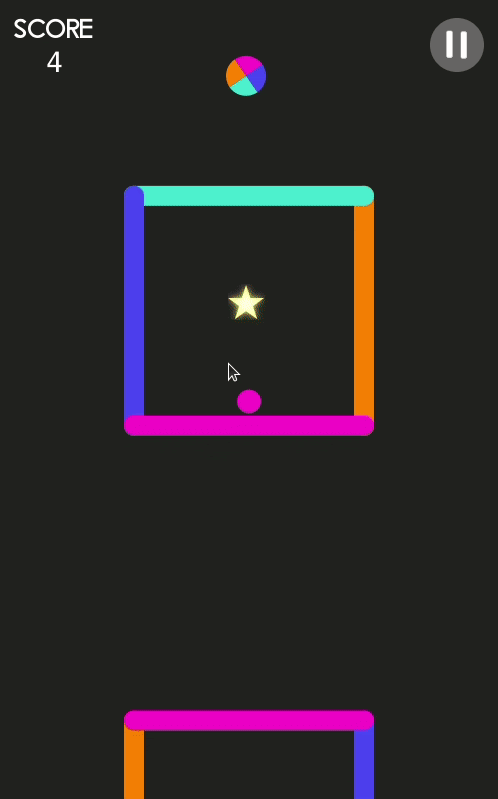
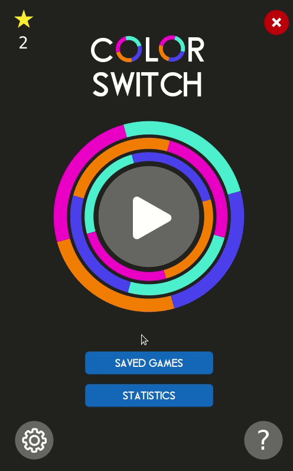

<h1>Color Switch</h1>

### Creators

- **[Ananya Lohani](https://ananyalohani.me/)**
- **[Mihir Chaturvedi](https://mihir.ch/)**

### Instructions

This project uses Gradle to build the files, create executables and run the compiled code. It must be installed on your system.

To install Gradle, please see [gradle.org/install](https://gradle.org/install/).

For development:

- Run: `gradle run`
- Build (normal JAR): `gradle build`
- Clean: `gradle clean`

### Features

- **Obstacles**:
  We implemented 4 types of obstacles:

  - Circle: Rotate transition
  - Horizontal Bar: Translate transition
  - Gears: Two Rotate transitions
  - Square: Discrete rotation transition using `TimerTask`

  A new obstacle is dynamically added when the ball collides with a color changer.

- **Collision**: Collision of the ball with the obstacles, stars and color changers has been detected through a combination of `BoundsIntersects` and `BoundsTransformation`.

- **Speed Calculation**:

  - We use the duration since the last user input to calculate the ball’s new position.
  - Acceleration due to gravity is a constant, and ball’s velocity depends on game score/difficulty.
  - The track shifts down once the ball reaches halfway on the screen.

- **Difficulty**:
  The game increases in difficulty as the user collects more points, after a threshold of 5 points.

  - **Gears** obstacle is introduced, which is relatively more difficult to cross than the other obstacles.
  - The displacement of the ball at every jump also linearly increases as the user collects more points.

- **Saving the Game**: The game is saved in 2 ways:
  - Serializing the state of the gameplay screen every time the user saves the game.
    - Ball color and position
    - Obstacle types, position and orientation
    - Star values
    - Game score
  - Serializing the instance of `ColorSwitch` which contains the statistics of the game and the list of saved games.

#### Other Miscellaneous Features

- Two types of stars
  - One point
  - Three points
- Statistics
  - Total stars collected
  - Highscore
  - No. of games played
  - Total time played
  - No. of revivals
  - No. of games saved
- Instructions
- Settings
- Gameplay Music
- End Game Animation

### Gameplay

